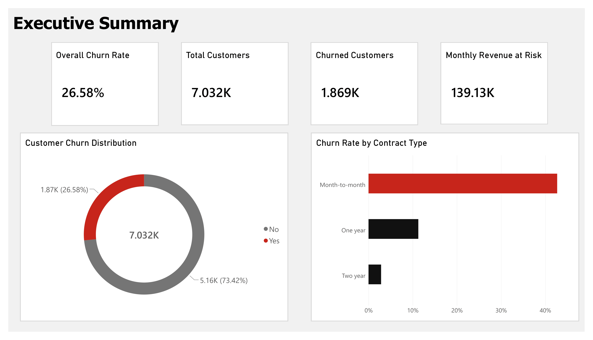
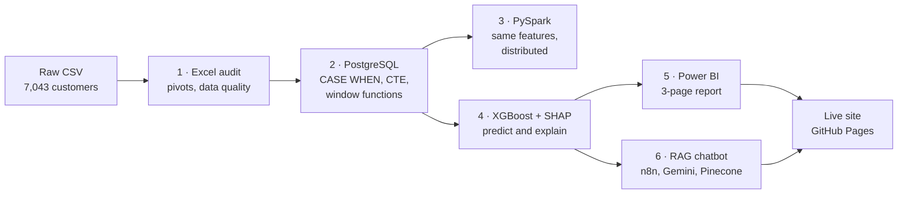
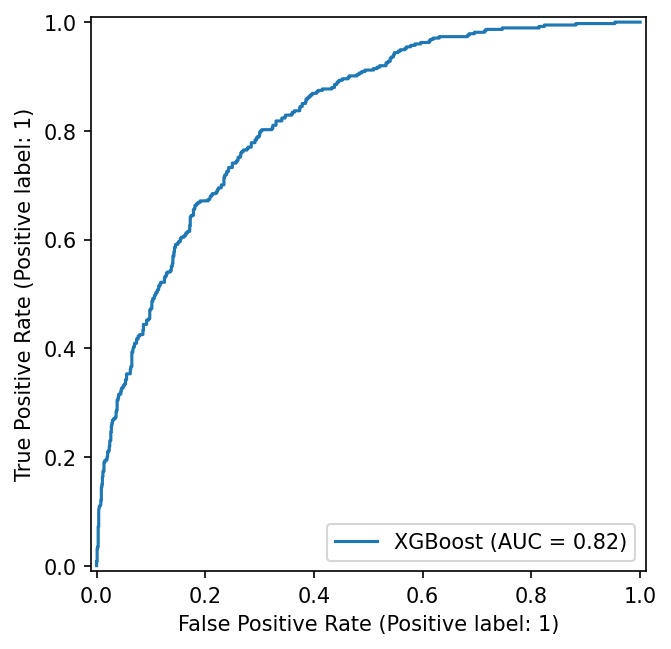
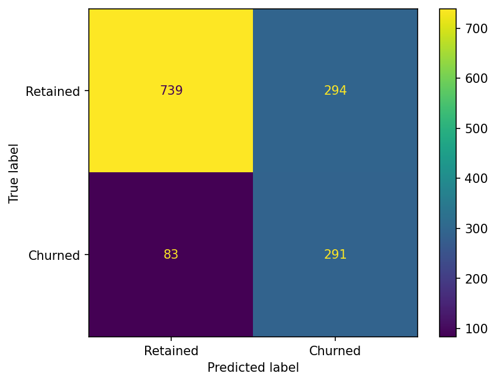
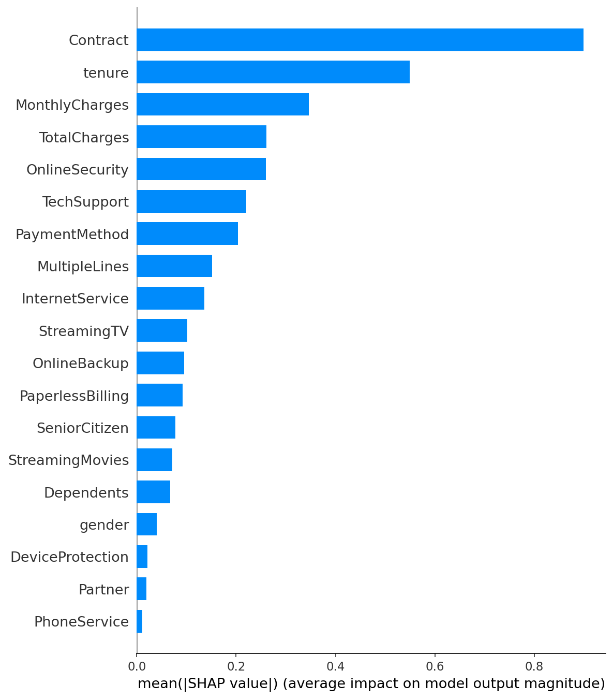
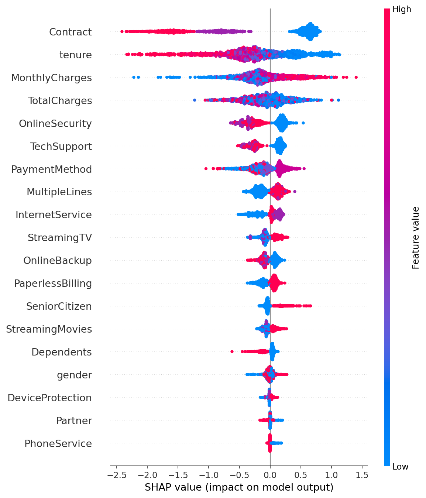
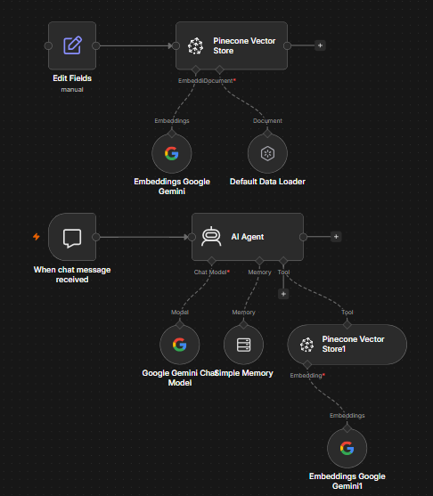

# Customer Churn Intelligence Platform

**Who is about to cancel, why, and what would keep them.** An end-to-end churn project on 7,032 telecom customers: a spreadsheet audit, SQL and PySpark feature engineering, an XGBoost model explained with SHAP, a Power BI report, and a RAG chatbot that answers questions about the findings in plain English.

[](https://krishjaiswal27.github.io/Customer-Churn-Intelligence/)
[](powerbi/Churn_Intelligence_Dashboard.pdf)
[](https://krishjaiswal27.github.io/Customer-Churn-Intelligence/#ask)

*Data source: IBM Telco Customer Churn, a public sample dataset (7,043 customers, 21 columns). Framed as a stakeholder analysis for a subscription business's retention team.*

---

## Executive Summary

Most churn reporting stops at one number: *"26.6% of customers left."* That tells a retention team there is a problem, but not who to call, what to offer them, or whether the effort will pay off. I built a pipeline that answers all three: it engineers features from a messy raw export, predicts each customer's probability of leaving, explains **why** each prediction was made, and puts the findings behind a chatbot so a non-technical stakeholder can simply ask.



| At a glance | |
|---|---|
| Customers analysed | 7,032 (after cleaning) |
| Churned | 1,869 (26.6%) |
| Monthly recurring revenue lost to churn | ≈ $139K |
| Month-to-month vs two-year churn | 42.7% vs 2.8% (15×) |
| Model ROC-AUC on held-out customers | 0.824 |
| Customers flagged high-risk (p > 0.70) | 1,704 |

The clearest finding: **month-to-month customers churn at 42.7%, fifteen times the 2.8% rate of two-year contract holders**, and SHAP ranks contract type as the single strongest driver in the model. Combined with tenure and payment method, it points to a specific, targetable profile. The 50 highest-risk customers are all on month-to-month contracts, most in their first month, paying roughly $78 to $101 a month.

I recommend the retention team:
1. **Convert early month-to-month customers to annual contracts** with a first-year discount, before month 12
2. **Move electronic-check payers to automatic payment** (45.3% churn vs 15.3% on automatic card)
3. **Bundle online security and tech support** as retention tools, since not having them ranks among the top six churn drivers
4. **Point retention budget at high spenders**, who churn more (34.7%), not less, than low spenders (10.9%)

## Business Problem

Two traps make naive churn analysis misleading:

- **The accuracy trap.** With only 26.6% of customers churning, a model that predicts "nobody leaves" is 73% accurate and completely useless. Accuracy is the wrong yardstick; what matters is how many real churners the model catches, and what it costs in false alarms.
- **The black-box trap.** A risk score with no explanation gives a retention team nothing to act on. "Customer 7216 has a 0.99 churn probability" is a list; "because they're one month into a month-to-month plan, paying $100 by electronic check" is a campaign.

So I framed the project as three stakeholder questions: **which customers are likely to leave next, what is driving that risk, and what action would change it?**

## Architecture



## Methodology

**1. Excel audit** — Before writing any code, I profiled the raw export with pivot tables (churn by contract, tenure, payment method). This caught the issue that would have broken every later step: `TotalCharges` was stored as **text**, with 11 blank values belonging to brand-new, zero-tenure customers. They were dropped, taking the data from 7,043 to 7,032 rows.

**2. PostgreSQL feature engineering** — Loaded the raw data and built a `features` table with `CASE WHEN` logic: tenure buckets, spend tiers, a numeric churn flag, and a safely cast `TotalCharges`. I then added an enriched table using a CTE and two window functions, so each customer is compared against others on the same contract.

<details>
<summary>The CTE + window function query</summary>

```sql
CREATE TABLE features_enriched AS
WITH contract_stats AS (
    SELECT
        customer_id, contract, tenure, monthly_charges, churn_value,
        ROUND(AVG(monthly_charges) OVER (PARTITION BY contract), 2) AS avg_charges_by_contract,
        RANK() OVER (PARTITION BY contract ORDER BY monthly_charges DESC) AS charge_rank_in_contract
    FROM features
)
SELECT *,
       ROUND(monthly_charges - avg_charges_by_contract, 2) AS charge_vs_contract_avg
FROM contract_stats;
```
</details>

**3. PySpark replication** — Rebuilt the same features with Spark DataFrames (`when().otherwise()`, `Window.partitionBy()`), saved as Parquet, and validated against SQL: **identical 7,032 rows and an identical $66.40 month-to-month average charge** in both engines. The logic is ready to run at a scale PostgreSQL on one machine couldn't handle.

**4. XGBoost + SHAP** — Trained an XGBoost classifier (200 trees, depth 4, learning rate 0.1) on an 80/20 stratified split, with `scale_pos_weight ≈ 2.76` to counter the class imbalance. Evaluated on 1,407 customers the model never saw, then used SHAP to explain every prediction, globally and per customer.

**5. Power BI** — A three-page report (executive summary, segment deep-dive, customer risk scores) with a DAX risk label: **High** above 0.70, **Medium** 0.40 to 0.70, **Low** below 0.40.

**6. RAG chatbot** — The findings, model results, SHAP drivers and recommendations are chunked, embedded with Google Gemini (3,072 dimensions) and stored in a Pinecone index. A self-hosted n8n **AI Agent** decides when to search that index, answers with Gemini, and keeps conversation memory so follow-up questions work.

## Results

### Churn by segment

| Segment | Highest-risk group | Churn rate | Lowest-risk group | Churn rate |
|---|---|---|---|---|
| Contract | Month-to-month | **42.7%** | Two year | 2.8% |
| Tenure | 0–12 months | **47.7%** | 24+ months | 14.0% |
| Payment method | Electronic check | **45.3%** | Credit card (automatic) | 15.3% |
| Monthly spend | High (> $65) | **34.7%** | Low (< $35) | 10.9% |

The spend finding is the counterintuitive one: **the customers paying the most are the most likely to leave**, so every churn event at the top of the market costs more revenue.

### Model performance (held-out test set, 1,407 customers)

| | Predicted to stay | Predicted to leave |
|---|---|---|
| **Actually stayed** | 739 | 294 *(false alarms)* |
| **Actually left** | 83 *(missed)* | **291** *(caught)* |

| ROC-AUC | Recall | Precision | F1 | Accuracy |
|---|---|---|---|---|
| **0.824** | **0.78** | 0.50 | 0.61 | 0.73 |

The model catches **291 of 374 real churners (78%)**. About half of the customers it flags would have stayed, and that is a deliberate trade-off: a missed churner takes their monthly revenue with them, while a false alarm costs one retention offer. The decision threshold can be moved to fit a real retention budget.

<p>
  
  
</p>

### What drives churn (SHAP)

Top drivers, in order: **Contract, tenure, MonthlyCharges**, TotalCharges, OnlineSecurity, TechSupport, PaymentMethod, MultipleLines, InternetService, StreamingTV. Month-to-month contracts, short tenure, high monthly charges, and missing security/support add-ons all push predictions toward churn.

<p>
  
  
</p>

The SHAP ranking independently confirms the segment analysis: the model, trained without being told which features matter, arrives at the same top three drivers the pivot tables surfaced in phase 1.

### Recommendations

| Action | Evidence |
|---|---|
| Offer discounted annual contracts to month-to-month customers before month 12 | Month-to-month churns at 42.7% vs 11.3% (one year) and 2.8% (two year); first-year customers churn at 47.7% |
| Move electronic-check payers to automatic payment | 45.3% churn on electronic check vs 15.3% on automatic card |
| Bundle online security and tech support as retention tools | Both rank in the SHAP top six; their absence pushes predictions toward churn |
| Weight retention budget toward high spenders | High spenders churn at 34.7% vs 10.9% for low spenders, and each one lost costs more |

## The RAG chatbot



Two branches in one n8n workflow: an **ingestion** branch that loads the knowledge base ([`rag/churn_knowledge_base.txt`](rag/churn_knowledge_base.txt)) into Pinecone, and a **chat** branch where an AI Agent answers questions. Because the vector store is exposed to the agent as a *tool*, it only searches when a question needs data. Small talk like "hi" gets a normal reply instead of a forced retrieval.

**Example exchange (from the recorded demo):**
> **Q:** Which payment method should we target for retention campaigns?
>
> **A:** Electronic check. Those customers churn at 45.3%, nearly 3× the rate of automatic methods (credit card 15.3%, bank transfer 16.7%). Moving them to automatic payment reduces friction and correlates with much lower churn.

Every number the chatbot can state comes from the same validated dataset as the dashboard and the site. API keys live only in n8n credentials and never touch the website. [Watch the demo on the live site →](https://krishjaiswal27.github.io/Customer-Churn-Intelligence/#ask)

## Keeping the numbers honest

A pipeline with five tools has five places for numbers to drift apart. These checks kept them consistent:

- **Excel → SQL:** the pivot-table churn rates from the audit were re-derived in SQL and matched exactly (42.7% / 11.3% / 2.8%).
- **SQL → PySpark:** same row count and the same $66.40 month-to-month average in both engines.
- **CSV → Power BI:** a dashboard card originally showed 1,587 high-risk customers while the scored CSV had 1,704. I traced it to a misconfigured visual filter, fixed it, and retook every screenshot.
- **Data → website:** the site's charts are generated by [`scripts/build_site_data.py`](scripts/build_site_data.py), which recomputes every figure from the CSV and prints a validation report against the reference values instead of trusting hard-coded numbers.
- **Data → chatbot:** the knowledge base was regenerated from the same validated figures, so the bot and the dashboard never disagree.

## Tech stack

| Layer | Tools |
|---|---|
| Data prep & audit | Excel (pivot tables), pandas |
| Feature engineering | PostgreSQL (CTEs, window functions), PySpark, Parquet |
| Modelling | XGBoost, scikit-learn, SHAP |
| BI | Power BI Desktop, DAX |
| GenAI | n8n (self-hosted on Docker), Google Gemini, Pinecone |
| Delivery | HTML/CSS/JS, Chart.js, GitHub Pages, Google Colab, Git |

## Repository structure

```
├── data/                  # cleaned and scored datasets
│   ├── telco_with_predictions.csv
│   └── telco_features_pyspark.csv
├── sql/                   # table creation, loading, feature engineering, analysis
├── notebooks/
│   ├── pyspark_features.ipynb   # phase 3: distributed feature engineering
│   └── ml_shap.ipynb            # phase 4: XGBoost, evaluation, SHAP
├── powerbi/               # .pbix report and PDF export
├── rag/                   # knowledge base + exported n8n workflow
├── assets/                # screenshots and plots used here and on the site
├── scripts/               # site data builder (with validation) and image optimiser
└── docs/                  # the live site, served by GitHub Pages
```

## Run it yourself

<details>
<summary>Step-by-step</summary>

**SQL** — create a PostgreSQL database, then run the files in `sql/` in order: create the table, load the CSV with `\copy`, then feature engineering, advanced features, and analysis.

**Notebooks** — open `notebooks/pyspark_features.ipynb` and `notebooks/ml_shap.ipynb` in Google Colab, upload the raw Telco CSV when prompted, and run top to bottom.

**Power BI** — open `powerbi/Churn Intelligence.pbix` in Power BI Desktop.

**Chatbot**
```bash
docker run -it --rm --name n8n -p 5678:5678 -v n8n_data:/home/node/.n8n n8nio/n8n
```
Open `http://localhost:5678`, import `rag/churn_rag_pipeline.json`, add your own Google Gemini and Pinecone credentials, create a Pinecone index (3,072 dimensions, cosine), and run the ingestion branch once.

**Site**
```bash
python scripts/build_site_data.py
python -m http.server 8000
```
Then open `http://localhost:8000/docs/`.
</details>

## Limitations

- The dataset is a public IBM sample: the findings demonstrate the method, not the behaviour of a real company.
- Model metrics come from the held-out 20% test set. The risk scores in the dashboard and site come from scoring the **full** dataset, including rows the model trained on, so they illustrate the workflow rather than out-of-sample accuracy.
- Correlation is not causation: electronic-check users skew month-to-month, so the payment-method effect may be partly a contract effect.
- The chatbot is self-hosted and only live while its host machine runs; the site shows a recorded demo otherwise.

## Next Steps

1. **Tune the decision threshold to a real budget** — pick the cutoff that maximises retained revenue minus offer cost, rather than the default 0.5.
2. **Test causality** — A/B test an automatic-payment incentive to separate the payment-method effect from the contract effect.
3. **Score new customers only** — retrain on a time-based split and score customers the model has never seen, so the risk list reflects true out-of-sample predictions.
4. **Keep the chatbot current** — replace the static knowledge base with a scheduled n8n job that re-ingests the latest scored results.
